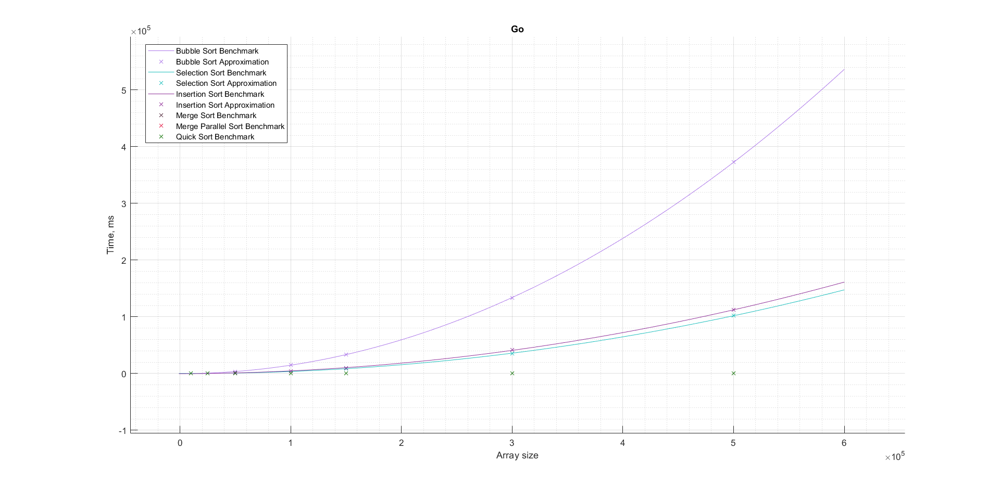

# Content
- [Content](#content)
- [Brief Description](#brief-description)
- [Project purpose](#project-purpose)
- [Languages](#languages)
- [Implementation Details](#implementation-details)
  - [Algorithms](#algorithms)
    - [**Bubble Sort**](#bubble-sort)
    - [**Selection Sort**](#selection-sort)
    - [**Insertion Sort**](#insertion-sort)
    - [**Merge Sort**](#merge-sort)
    - [**Quick Sort**](#quick-sort)
  - [Data Structures](#data-structures)
    - [Go](#go)
- [Benchmarks](#benchmarks)
  - [Go](#go-1)
- [Progress](#progress)
  - [TODO](#todo)
# Brief Description
Sort Research project is a collection of sorting algorithms written in different programming languages and their benchmark results.
# Project purpose
The main purpose of this project is to write most of popular sorting algorithms to study them, and find out their difference when being implemented on different languages and additionally collect benchmark results and put them into one table, so it will be easy to compare them. For simplicity (maybe in future it will be changed) only integers are sorted. The list of used languages for now you can find in section [Languages](#languages). Obviously, it is important to use exactly same algorithms and most alike data structures in code, so it is closely discussed in section [Implementation Details](#implementation-details).
# Languages
Here is the list of already implemented/being implemented languages and also planned ones.

- [x] Go
- [ ] C
- [ ] C++
- [ ] Python
- [ ] Java
# Implementation Details
Benchmarks require algorithms to be implemented in the same way and with similiar data structures to be more accurate. For convenience, here are all algorithms (brief description, complexity, pseudo-code) and data structures used in the project.
## Algorithms
### **Bubble Sort**

*Time complexity: O(N^2)*

*Space complexity: O(1)*

Iterate through array and swap adjacent elements if they are not on their place.
```
for i from 0 to N {
    for j from i + 1 to N {
        if a[i] < a[j]
            swap(a[i], a[j])
    }
}
``` 
### **Selection Sort**

*Time complexity: O(N^2)*

*Space complexity: O(1)*

Iterate through array, repeatedly find minimum element and put it into the beggining of the array
```
for i from 0 to N {
    min = a[i]
    for j from i + 1 to N {
        find min
        swap(a[i], min)
    }
}
```
### **Insertion Sort**

*Time complexity: Best - O(N), Worst - O(N^2)*

*Space complexity: O(1)*

Iterate through array, pick an element and swap with prescending ones until it is bigger or equal to prescending one.
```
for i from 1 to N {
    for j from i - 1 to 0 {
        if a[j] > a[j+1]
            swap(a[j], a[j+1])
        else
            break
    }
}
```
### **Merge Sort**

*Time complexity: O(N\*log(N))*

*Space complexity: O(N)*

Divide array into two halfs, call recursive sorting method for each one, then merge sorted halfs into one sorted array. Parallelism suits this algorithm very well, so such version is implented, too: all the same, except for recursive calls being called in parallel.
```
function mergeSort(arr array) {
    firstHalf = arr[0:middle+1]
    secondHalf = arr[middle+1:N]

    mergeSort(firstHalf)
    mergeSort(secondHalf)
    
    return merge(firstHalf, secondHalf)
}
```

### **Quick Sort**

*Time complexity: Best and everage - O(N\*log(N)), Worst - O(N^2)*

*Space complexity: O(log(N))*

Choose pivot element from the array to start from, divide array into two parts: elements that are greater or equal than the pivot element, and ones that are less than the pivot element, then recursively call quick sort for these parts.

```
function quickSort(arr array, start int, end int) {
    if start < end - 1 {
        pivotIdx = doPivot(array, starn, end)
        quickSort(arr, start, pivotIdx)
        quickSort(arr, pivotIdx, end)
    }
}
```
## Data Structures
### Go
Slices are used for storing array. Benchmarking and testing is done with built-in tools (*testing* package). Concurrency is implemented with the help of goroutines and wait groups for synchronization.
# Benchmarks
Test data for benchmarking is generated with *Go* and stored in JSON files: arrays of 50000, 200000 and 500000 elements generated with *rand* package. All benchmarks are done on AMD Ryzen 5 4600H CPU on Windows 10.
## Go

# Progress
Project is in early development.    
## TODO
- [x] Design table for benchmard data 
- [ ] Export benchmark data to table
- [ ] Write sort algorithms/benchmarks for other languages
- [ ] Add different benchmarks: random array, worst cases, already sorted arrays